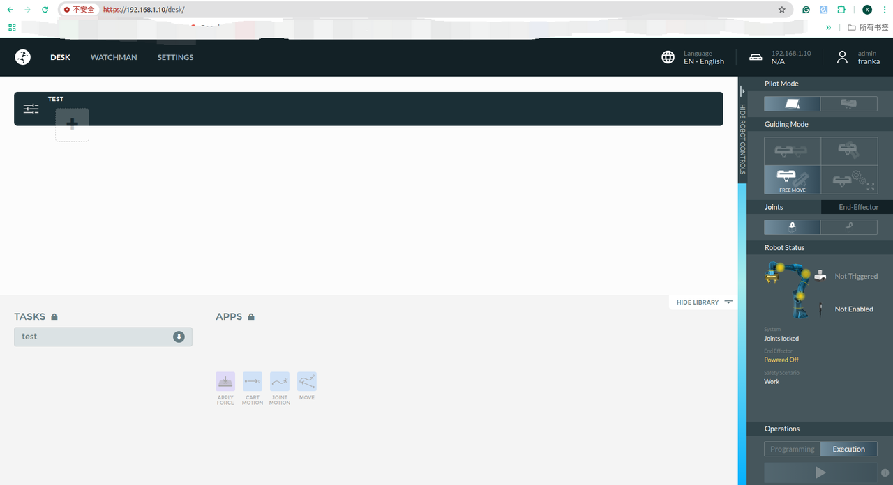
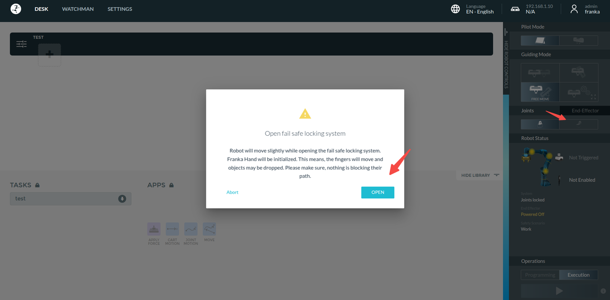
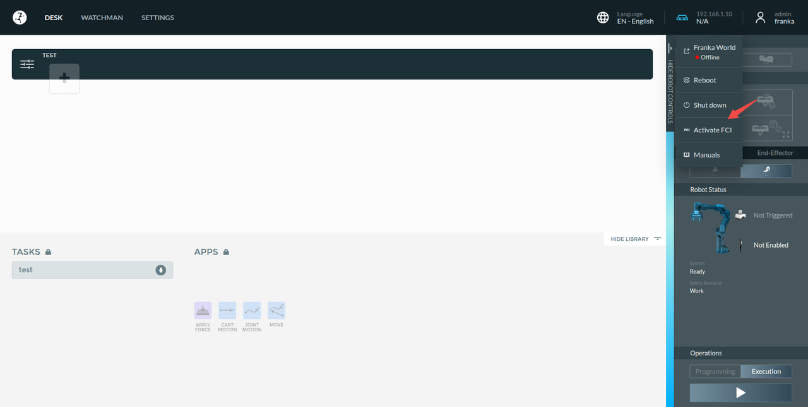
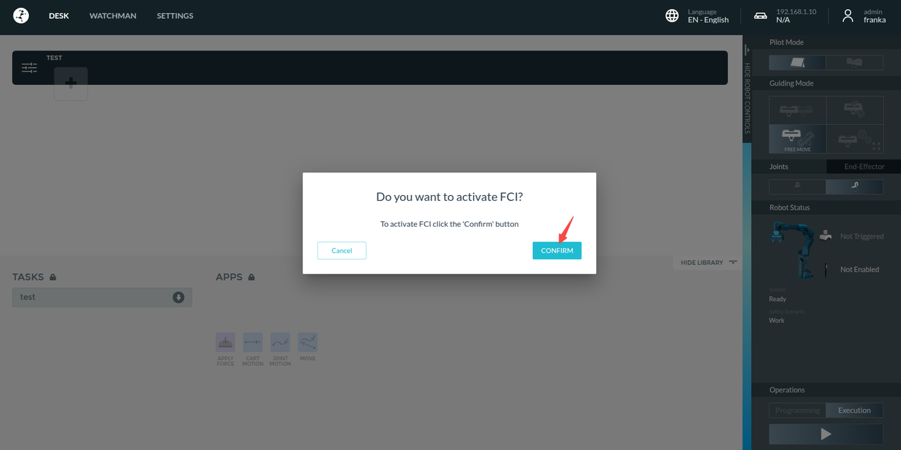
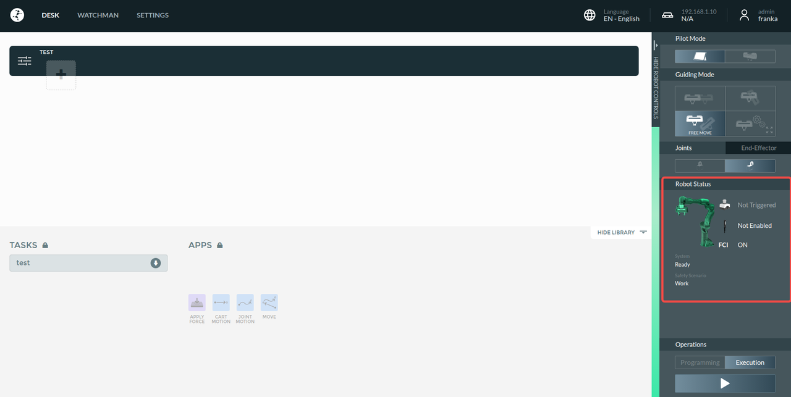
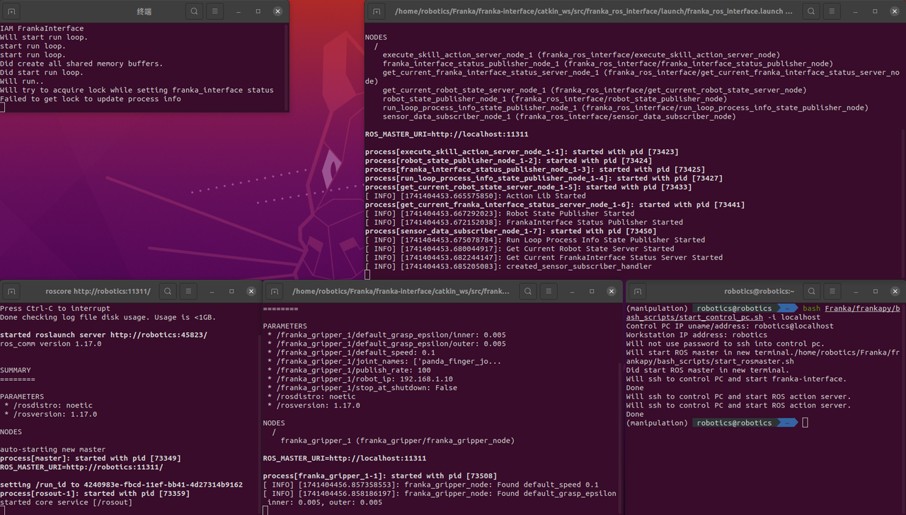
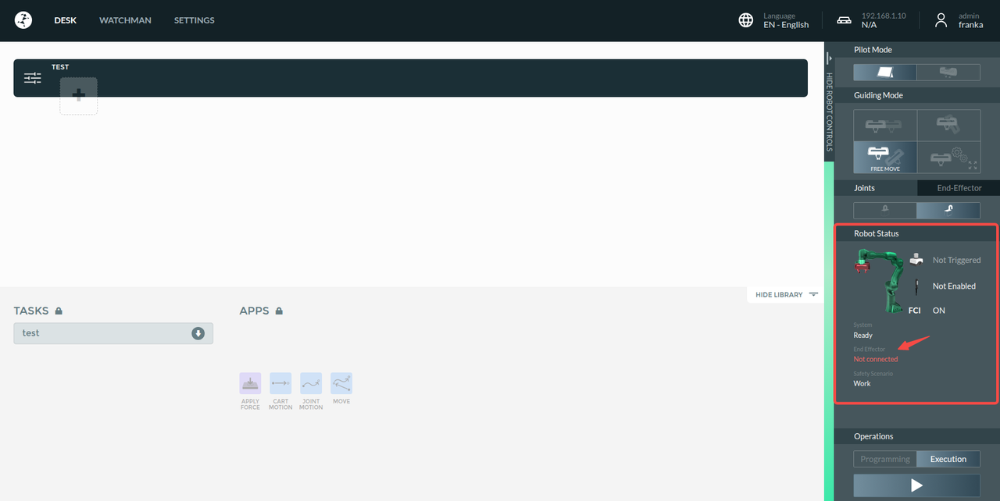

# Reading Order (very important !):
1. [Hardware Setting](https://github.com/ChangerC77/libfranka/blob/fr3/Hardware%20Setting.md)
2. [real-time kernal.md](https://github.com/ChangerC77/libfranka/blob/dev/real-time%20kernal.md)\
Before you using `Franka FCI`, you `MUST` set up `real-time kernal` first, because `real-time kernal` will make sure that the rate of control reaches 1kHz without delay. see more details in `real-time kernal.md`
3. [libfranka](https://github.com/ChangerC77/libfranka)
4. [franka-interface](https://github.com/ChangerC77/franka-interface) 
5. frankapy (current markdown)

# frankapy
## Reference
1. https://github.com/iamlab-cmu/frankapy

2. https://iamlab-cmu.github.io/frankapy/index.html

## Introduction
This is a software package used for controlling and learning skills on the Franka Research Arm (Emika Panda and Franka Research 3)

Installation Instructions and Network Configuration Instructions are also available here: [https://iamlab-cmu.github.io/frankapy](https://iamlab-cmu.github.io/frankapy)

To join the Discord community, click the link [here](https://discord.gg/r6r7dttMwZ).

## System Requirements

* A computer with the Ubuntu 18.04 / 20.04.
* ROS Melodic / Noetic
* [Protocol Buffers](https://github.com/protocolbuffers/protobuf)

## Computer Setup Instructions

This library is intended to be installed on any computer in the same ROS network with the computer that interfaces with the Franka (we call the latter the Control PC).
`FrankaPy` will send commands to [franka-interface](https://github.com/iamlab-cmu/franka-interface), which actually controls the robot.

## 1. Install ProtoBuf

**This is only needed if you plan to modify the proto messages. You don't need to install or compile protobuf for using frankapy**

We use both C++ and Python versions of protobufs so you would need to install Protobufs from source. 

Do `nproc` to find out how many cores you have, and use that as the `N` number in the `make` command below:
```
nproc
```
output (this is just an example of my computer)
```
12
```
then execute 

```shell
sudo apt-get install autoconf automake libtool curl make g++ unzip
cd $HOME/Franka/
wget https://github.com/protocolbuffers/protobuf/releases/download/v21.8/protobuf-all-21.8.zip
unzip protobuf-all-21.8.zip
cd protobuf-21.8
./configure
make -jN
make check -jN
sudo make install
sudo ldconfig
```
See detailed instructions [here](https://github.com/protocolbuffers/protobuf/blob/master/src/README.md)

## 2. Installation

### 1. Clone Repo and its Submodules:

   ```bash
   cd $HOME/Franka
   git clone --recurse-submodules git@github.com:iamlab-cmu/frankapy.git   
   ```
All directories below are given relative to `/frankapy`.

### 2. First source into your virtualenv or conda env (should be Python 3.6). Then:

```bash
pip install -e .
```
output
```
   ━━━━━━━━━━━━━━━━━━━━━━━━━━━━━━━━━━━━━━━━ 1.6/1.6 MB 2.9 MB/s eta 0:00:00
Downloading ruamel.yaml.clib-0.2.12-cp39-cp39-manylinux_2_17_x86_64.manylinux2014_x86_64.whl (724 kB)
   ━━━━━━━━━━━━━━━━━━━━━━━━━━━━━━━━━━━━━━━━ 724.9/724.9 kB 1.9 MB/s eta 0:00:00
Downloading threadpoolctl-3.5.0-py3-none-any.whl (18 kB)
Downloading tifffile-2024.8.30-py3-none-any.whl (227 kB)
Building wheels for collected packages: empy
  Building wheel for empy (setup.py) ... done
  Created wheel for empy: filename=empy-3.3.4-py3-none-any.whl size=29380 sha256=3ab9fd8ace346824ddf8cdb8a09722661c6af2c4c350ad90f872849a0175e684
  Stored in directory: /home/robotics/.cache/pip/wheels/c7/0a/c4/a0dc05ea753ca932849616e1c1886ad3c50aaa2c8f09c6a552
Successfully built empy
Installing collected packages: empy, threadpoolctl, setproctitle, ruamel.yaml.clib, protobuf, numpy, networkx, llvmlite, joblib, dill, colorlog, tifffile, ruamel.yaml, opencv-python, numpy-quaternion, numba, multiprocess, imageio, scikit-learn, scikit-image, autolab_core, frankapy
  Attempting uninstall: empy
    Found existing installation: empy 4.2
    Uninstalling empy-4.2:
      Successfully uninstalled empy-4.2
  Attempting uninstall: numpy
    Found existing installation: numpy 2.0.1
    Uninstalling numpy-2.0.1:
      Successfully uninstalled numpy-2.0.1
  DEPRECATION: Legacy editable install of frankapy==1.0.0 from file:///home/robotics/Franka/frankapy (setup.py develop) is deprecated. pip 25.1 will enforce this behaviour change. A possible replacement is to add a pyproject.toml or enable --use-pep517, and use setuptools >= 64. If the resulting installation is not behaving as expected, try using --config-settings editable_mode=compat. Please consult the setuptools documentation for more information. Discussion can be found at https://github.com/pypa/pip/issues/11457
  Running setup.py develop for frankapy
Successfully installed autolab_core-1.1.1 colorlog-6.9.0 dill-0.3.9 empy-3.3.4 frankapy imageio-2.37.0 joblib-1.4.2 llvmlite-0.43.0 multiprocess-0.70.17 networkx-3.2.1 numba-0.60.0 numpy-1.26.4 numpy-quaternion-2023.0.4 opencv-python-4.11.0.86 protobuf-6.30.0 ruamel.yaml-0.18.10 ruamel.yaml.clib-0.2.12 scikit-image-0.24.0 scikit-learn-1.6.1 setproctitle-1.3.5 threadpoolctl-3.5.0 tifffile-2024.8.30
   ```
   
### 3. To compile the catkin_ws use the following script:
```bash
./$HOME/Franka/frankapy/bash_scripts/make_catkin.sh
```

### 4. To allow asynchronous gripper commands, 
we use the `franka_ros` package, so install `libfranka` and `franka_ros` using the following command
+ noetic
```bash
sudo apt install ros-noetic-libfranka ros-noetic-franka-ros
```

### 5. To make the protobufs use the following script (**you don't need to do this if you haven't modified the proto messages**):
```bash
./$HOME/Franka/frankapy/bash_scripts/make_proto.sh
```

## 3. Configuring the network with the Control PC

## 4. Running the Franka Robot
### 1. unlock the FR3 via Franka Desk GUI
#### 1. Desk Setting
`chrome`输入机械臂控制器`ip`地址进入`Desk`


#### 2. activate joint


会听到喀哒喀哒的解锁声音

之后状态变成这样


然后激活`FCI`




显示这样的状态证明激活



make sure the operations option in Execution option so that can use programs to control

### 2. modify the sh file according to your computer
```
control_pc_uname="robotics"
control_pc_use_password=0
control_pc_password=""
control_pc_franka_interface_path="/home/robotics/Franka/franka-interface"
start_franka_interface=1
robot_number=1
robot_ip="192.168.1.10"
with_gripper=1
old_gripper=0
log_on_franka_interface=0
stop_on_error=0
```
here you should set

1. `control_pc_uname`: your ubuntu name
2. `control_pc_franka_interface_path`: your `franka-interface` path
3. `robot_ip`: your FR3 control unit ip

### 3. control the FR3
```bash
bash ./$HOME/Franka/frankapy/bash_scripts/start_control_pc.sh -i localhost
```


弹出4个窗口且没有报错则证明运行成功

### 4. set the environment
+ zsh
```
sudo vim ~/.zshrc
```
```
source $HOME/Franka/frankapy/catkin_ws/devel/setup.zsh
```
+ bash
```
sudo vim ~/.bashrc
```
```
source $HOME/Franka/frankapy/catkin_ws/devel/setup.bash
```
### 5. initialize the FR3
```bash
python $HOME/Franka/frankapy/scripts/reset_arm.py
```
output
```
WARNING:root:autolab_core not installed as catkin package, RigidTransform ros methods will be unavailable
Starting robot
Reset with joints
Opening Grippers
```
### 3. teach mode
```bash
python $HOME/Franka/frankapy/scripts/run_guide_mode.py
```
output
```
Starting robot
Applying 0 force torque control for 100s
Tra: [0.30519667 0.17031028 0.47904631]
 Rot: [[ 0.88890429  0.40035878  0.2226252 ]
 [ 0.40509148 -0.91390459  0.02606254]
 [ 0.21389255  0.06701647 -0.97455568]]
 Qtn: [0.01053589 0.97177216 0.2072117  0.11229941]
 from franka_tool to world
[-0.25088293 -0.97060835  0.51566798 -2.42281932  0.42787614  1.74904618
  0.44488596]
```
### 4. close gripper
```bash
python $HOME/Franka/frankapy/scripts/close_gripper.py
```
### 5. open gripper
```bash
python $HOME/Franka/frankapy/scripts/open_gripper.py
```
夹爪控制的话`DESK`会显示报错，这个不影响程序控制


### 6. get joint.py
```bash
python $HOME/Franka/frankapy/control/getJ.py
```
### 7. get ee 6 dof pose
```bash
python $HOME/Franka/frankapy/control/getP.py
```
### 8. ee 6 dof pose control
```bash
python $HOME/Franka/frankapy/control/moveP.py
```
### 9. joint position control
```bash
python $HOME/Franka/frankapy/control/moveJ.py
```
### 10. record trajectory
```bash
python  $HOME/Franka/frankapy/scripts/record_trajectory.py
```
默认记录`10s`轨迹数据，数据存储在`frankapy`下，文件名为`franka_traj.pkl`
### 11. run record trajectory
```bash
python scripts/run_recorded_trajectory.py -t franka_traj.pkl
```

See example scripts in the `examples/` and `scripts/` to learn how to use the `FrankaPy` python package.

## Citation

If this library proves useful to your research, please cite the paper below::
```
@article{zhang2020modular,
title={A modular robotic arm control stack for research: Franka-interface and frankapy},
author={Zhang, Kevin and Sharma, Mohit and Liang, Jacky and Kroemer, Oliver},
journal={arXiv preprint arXiv:2011.02398},
year={2020}
}
```
